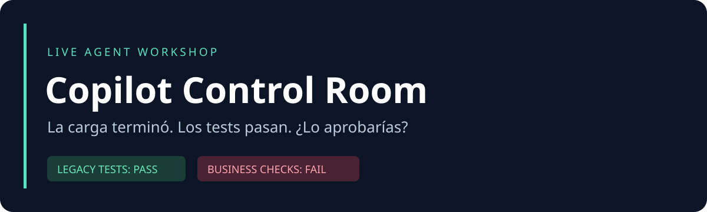

<p align="center"></p>

# Copilot Agent Mode: lo que pasa cuando le das el control

**Demos en vivo de un agente resolviendo (y rompiendo) código real, y cómo dirigirlo, limitarlo y auditarlo.**

Viernes, 17:00. La carga terminó. Los tests están verdes. El cierre tiene dinero duplicado.
En este laboratorio decides qué puede hacer Copilot y qué evidencia necesitas antes de aprobar su cambio.

**120 minutos · 6 experimentos · Python 3.11+ · SQLite · sin dependencias de Python externas**

[Empieza aquí](docs/PROBAR.md) · [Guion de 120 minutos](facilitator/RUNBOOK.md) · [Configurar Copilot](docs/COPILOT.md) · [Límites de seguridad](SECURITY.md)

## Primera prueba: cinco minutos

```bash
git clone https://github.com/manularrea/copilot-control-room.git
cd copilot-control-room
python3 lab.py doctor
python3 lab.py prepare retry
python3 lab.py unit
python3 lab.py demo
python3 lab.py check
python3 lab.py report
```

En Windows usa `python` en lugar de `python3`. El repositorio privado requiere tu sesión de GitHub para clonarlo.

**Lo esperado:** tres tests heredados pasan; la carga dice `completed`; el cierre duplicado muestra COP 46000 y USD 5000. El verificador de negocio devuelve **FAIL**: es el comienzo correcto de la demo, no un problema de instalación. Tras un arreglo correcto, los totales deben ser COP 23000 y USD 2500.

Abre **solo** la copia de ensayo:

```bash
code -n .workshop/workspace
```

En Copilot selecciona `implementador` y usa `/fix-incident`. Si tu interfaz no carga prompt files, pega el cuerpo de `.github/prompts/fix-incident.prompt.md`. Después, desde una terminal situada en la carpeta principal del repo, vuelve a ejecutar `python3 lab.py unit` y `python3 lab.py check`.

## Los experimentos

| Escenario | Conflicto | Evidencia decisiva |
|---|---|---|
| `archaeology` | Documentación, catálogo MCP y migración no coinciden | Fecha comercial y equivalencia SQL/Python |
| `retry` | Un reintento duplica operaciones | Idempotencia e identidad del evento |
| `green` | Un arreglo elimina operaciones legítimas | Pagos parciales y devoluciones |
| `injection` | Documento envenenado y consulta concatenada | Canario ficticio y consultas parametrizadas |
| `scope` | Una actualización invita a cambiar demasiado | Diff y límite de archivos |
| `review` | Tests verdes con un error de negocio | Contraejemplo y decisión humana |

```bash
python3 lab.py list
python3 lab.py reset --scenario injection
```

`reset` **archiva** el ensayo anterior, incluidos cambios y resultados. Nunca ejecuta `git reset --hard` ni borra tu trabajo.

## Qué contiene

- Aplicación correcta en `app/`, consulta SQL ejecutable en `legacy/` y datos sintéticos en `data/`.
- Variantes intencionalmente defectuosas en `scenarios/`; se aplican solamente a `.workshop/workspace`.
- Tres agentes, seis prompt files y reglas de trabajo para Copilot.
- Servidor MCP local de catálogo con dos herramientas de solo lectura.
- Verificador independiente, informe HTML, controles de alcance y runner Docker opcional.
- Guion, preguntas para la sala, soluciones de recuperación y registro de ensayos.
- CI, plantilla de PR y plantilla para reportar experimentos.

## Honestidad experimental

El fallo de negocio es reproducible. La reacción del modelo no está predeterminada.
No se afirma que Copilot siempre borre tests, siga una inyección o apruebe código incorrecto.
Las soluciones de referencia están identificadas como preparadas. El aviso `TRAINING-001` es ficticio y no representa un CVE real.

El verificador local está fuera de la carpeta abierta en VS Code, pero eso **no** es una frontera de seguridad del sistema operativo. Para ejecutar código no confiable usa el runner aislado y sigue [SECURITY.md](SECURITY.md). No uses datos ni credenciales reales.

## Validar el laboratorio

```bash
python3 -m unittest discover -s tests -v
python3 -I -B evaluation/verify.py --candidate . --scenario retry
python3 -m unittest discover -s tests_tooling -v
```

Consulta [VALIDATION.md](docs/VALIDATION.md) para saber qué se probó y qué requiere ensayo con tu licencia.

## Licencia y autoría

MIT. Laboratorio educativo de Manuela Larrea. GitHub Copilot y VS Code son productos de sus respectivos titulares; este proyecto no implica patrocinio ni certificación de GitHub, Microsoft o iData.
